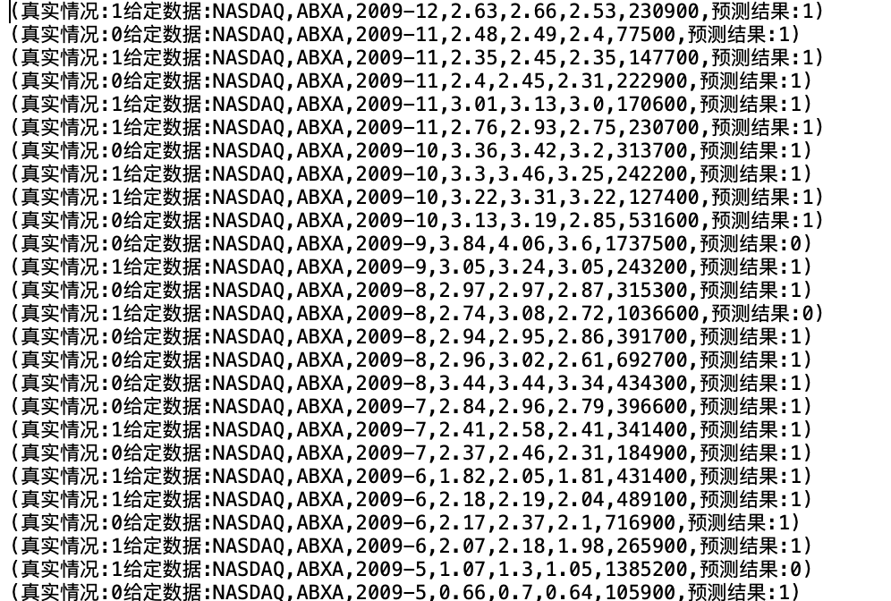

# 201220125 陈飞月 实验四

### 代码思路：

#### 任务一：

##### 第一问：

​	1.mapToPair转化为JavaRDD<String, Integer>

​	2.reduceByKey统计交易量

​	3.sortByKey针对交易量排序（运用mapToPair交换两次key，value）

​	4.mapToPair调整key为年份

​	5.partitionBy根据年份分区

​	6.saveAsTextFile存入文件

##### 第二问：

​	1.mapToPair转化为JavaRDD<String, Float>（<交易所> <股票代码> <交易⽇期> <收盘价> <开盘价>， <差价>）

​	2.sortByKey针对差价排序（运用mapToPair交换两次key，value）

​	3.take取前10条，parallelize转化为JavaRDD

​	4.saveAsTextFile存入文件

#### 任务二：

​	1.spark.read().csv(path)读入文件至Dataset< Row>

​	2.createOrReplaceTempView创建表格

​	3.SELECT dividends._ c2, dividends._ c1, stock._ c6 FROM stock RIGHT JOIN dividends ON dividends._ c1 = stock._ c1 AND dividends._ c2 = stock._ c2 WHERE dividends._c1 = 'IBM'"根据股票代码及日期join两张表，并筛选出股票代码为IBM的公司-第一问

​	4.SELECT * FROM(

​		SELECT DISTINCT year, AVG(_c8)OVER(PARTITION BY year) as avg_adj_close FROM(

​			SELECT _ c8, left(_c2,4) as year FROM stock WHERE _c1 = 'AAPL')//选取AAPL公司的调整后收盘价和年份

​	   ) WHERE avg_adj_close > 50 ORDER BY year//按照年份分区取平均

#### 任务三：

​	1.map中的LabeledPoint call(String str) 将数据转化为特征向量->标签的形式

​	2.randomSplit将数据随机分为训练集和测试集

​	3.利用训练集train模型（朴素贝叶斯）

​	4.mapToPair中的Tuple2<Double, Double> call(LabeledPoint p)生成预测值和真实值的JavaPairRDD<Double, Double>

​	5.用filter筛选出相等的部分并统计出精确度

​	6.改写mapToPair，通过训练好的模型生成<测试数据，预测结果>的JavaPairRDD<String，String>，保存为文件

### 实验结果：

#### 任务一

Q1

Q2

#### 任务二

Q1

Q2

#### 任务三

模型精度为：0.36385132039833956

