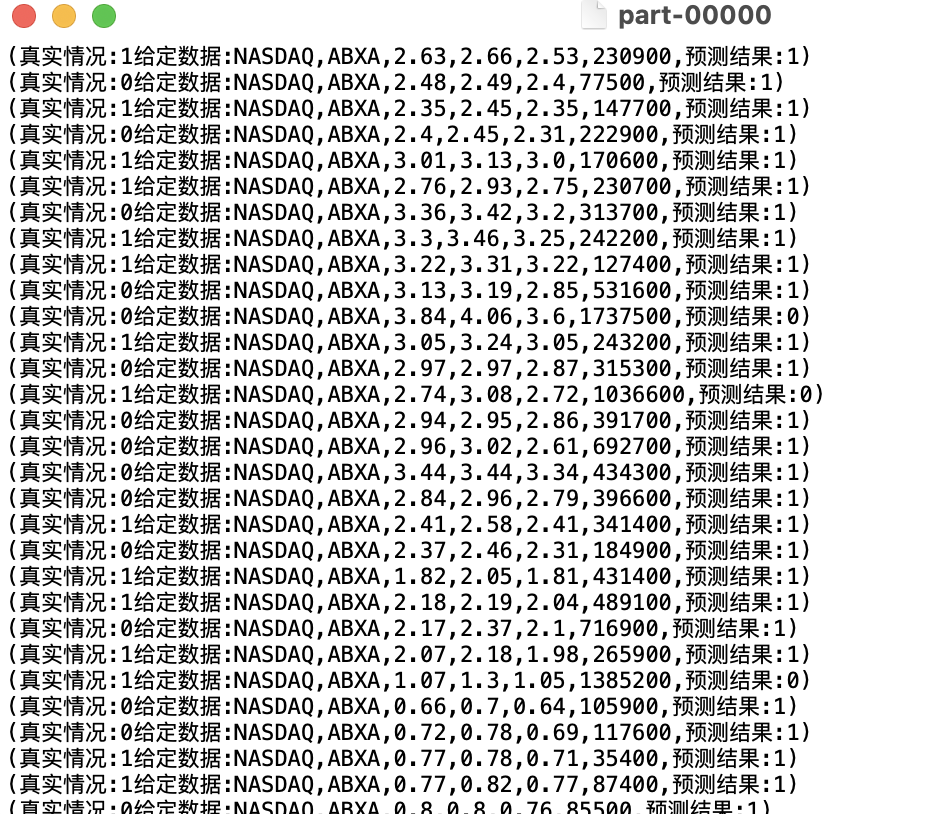

# Spark分布式技术

### 代码思路：

#### 任务一：

##### 第一问：

​	1.mapToPair转化为JavaRDD<String, Long>

​	2.reduceByKey统计交易量

​	3.sortByKey针对交易量排序（运用mapToPair交换两次key，value）

​	4.mapToPair调整key为年份

​	5.partitionBy根据年份分区

​	6.saveAsTextFile存入文件

##### 第二问：

​	1.mapToPair转化为JavaRDD<String, Float>（<交易所> <股票代码> <交易⽇期> <收盘价> <开盘价>， <差价>）

​	2.sortByKey针对差价排序（运用mapToPair交换两次key，value）

​	3.take取前10条，parallelize转化为JavaRDD

​	4.saveAsTextFile存入文件

#### 任务二：

​	1.spark.read().csv(path)读入文件至Dataset< Row>

​	2.createOrReplaceTempView创建表格

​	3.SELECT dividends._ c2, dividends._ c1, stock._ c6 FROM stock RIGHT JOIN dividends ON dividends._ c1 = stock._ c1 AND dividends._ c2 = stock._ c2 WHERE dividends._c1 = 'IBM'"根据股票代码及日期join两张表，并筛选出股票代码为IBM的公司-第一问

​	4.SELECT * FROM(

​		SELECT DISTINCT year, AVG(_c8)OVER(PARTITION BY year) as avg_adj_close FROM(

​			SELECT _ c8, left(_c2,4) as year FROM stock WHERE _c1 = 'AAPL')//选取AAPL公司的调整后收盘价和年份

​	   ) WHERE avg_adj_close > 50 ORDER BY year//按照年份分区取平均

#### 任务三：

​	1.map中的LabeledPoint call(String str) 将数据转化为特征向量->标签的形式

​	2.randomSplit将数据随机分为训练集和测试集

​	3.利用训练集train模型（朴素贝叶斯）

​	4.mapToPair中的Tuple2<Double, Double> call(LabeledPoint p)生成预测值和真实值的JavaPairRDD<Double, Double>

​	5.用filter筛选出相等的部分并统计出精确度

​	6.改写mapToPair，通过训练好的模型生成<测试数据，预测结果>的JavaPairRDD<String，String>，保存为文件

### 遇到问题：

1.课件及网络上的代码多使用的是scala，因此在整体的代码框架搭建上花费了较多时间

2.JavaRDD< LabeledPoint>保存为文件后的格式为(0.0,[1.0,251.0,2006.0,5.0,14.01,14.2,14.01,18700.0])，这种格式非常具有欺骗性，会让人误以为是列表之类的数据类型，因此在处理时很容易出现下标越界、无法转换为double等报错。实际上，重新读入后这是一个完整的字符串，对于指标的获取只能通过substring获取再转为double。

3.第一题第一问跑完发现少了最高的几条数据，最终确认为求得的和数超过了Integer范围，应使用Long类型。

### 实验结果：

#### 任务一

Q1

Q2

#### 任务二

Q1

Q2

#### 任务三

朴素贝叶斯-所有指标（日期只使用年月）-模型精度为：0.36385132039833956

朴素贝叶斯-不使用日期-模型精度为：0.4135028085334311

朴素贝叶斯-不使用所有字符类型指标及年份-模型精度为：0.6562876614818626

**结果分析：**开盘价格、最⾼价格、最低价格和交易量这四个指标对于分类的影响应当是更大更直观的，加入公司、股票代码以及日期等信息后，很可能反而对预测造成了干扰。加上我的代码中没有做归一化处理，年份、股票代码等指标数值较大，对结果的影响可能也造成了更大的干扰。
